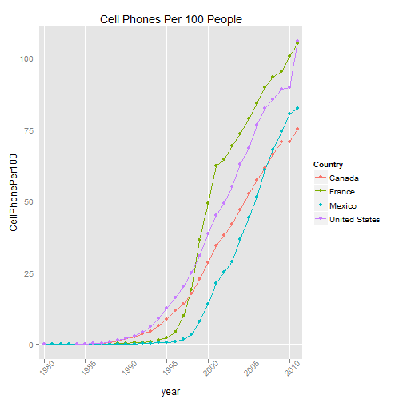

Shiny App Presentation
========================================================
author: Susan S.
date: October 21, 2015


<center>Growth of Mobile Celluar Subscriptions per 100 of Population by 
Country</center>

========================================================

This project uses shiny to provide an HTML select box for
users to select up to 10 countries to display on a graph.
It reactively renders a ggplot graph each time a country is selected or 
deselected and uses the selectizeInput widget in shiny to create the 
select user interface.

- App to display chart of Cell Phones per 100 of Population by Country
- Data taken from Gapminder
- Easily compare the growth of mobile cellular subscriptions in different countries 

Code for Plot
========================================================


```
ggplot(data = subset(tidycell, country %in% input$countries & year >= 1980), aes(x = year, y = CellPhonePer100, group = country, colour=country), na.rm=TRUE) +
      geom_line(na.rm=TRUE) + geom_point(na.rm=TRUE) +
      scale_x_discrete( 
        breaks = seq(1980, 2011, by = 5)) +
      ggtitle("Cell Phones Per 100 People") +
      theme(axis.text.x = element_text(angle=45)) + labs(color = "Country")

```
Sample Plot (Hardcoded Countries)
========================================================

 

Why This App?
========================================================
R is good for exploratory data analysis.  If you want to keep changing what you 
are looking at to see if you can spot patterns or trends, designing a slidify app
can help you manually change your parameters.  This app could be expanded to allow
the user to select datasets for more exploration.  
